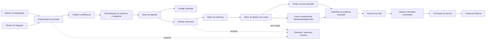

# EPIC-JORNADA-001 - Jornada autonoma de servico do cliente (Landing/Telegram -> Agenda -> Matching -> Avaliacao)

## 1. Metadados da EPIC

- Epic ID: `EPIC-JORNADA-001`
- Produto: `ConsertaPraMim`
- Data de criacao: `2026-03-15`
- Prioridade: `Critica`
- Status atual: `In Progress`
- Time alvo: `Backend`, `CPM Full`, `API`, `TelegramBridge`, `Integracoes`, `Dados`, `QA`, `Operacao`
- Objetivo macro: automatizar a jornada do cliente desde a entrada por `landing/site` ou `Telegram` ate o agendamento, disparo para prestadores elegiveis, conexao entre as partes, conclusao do servico e avaliacao bilateral, mantendo handoff humano apenas por excecao.

## 2. Entendimento do negocio

- O cliente hoje pode entrar pela `landing/site`, informando dados para primeiro contato e autorizando receber mensagens no WhatsApp.
- O cliente tambem pode entrar pelo `Telegram`, via bot ja integrado ao CPM Full e ao Chatwoot.
- O objetivo principal do cliente quase sempre e `solicitar um servico`.
- A jornada ideal precisa chegar ate:
  1. coleta completa de dados do atendimento;
  2. definicao da categoria e da localizacao;
  3. sugestao e confirmacao de janela;
  4. criacao de evento no `Google Calendar`;
  5. disparo automatico apenas para prestadores elegiveis;
  6. conexao direta entre prestador e cliente;
  7. confirmacao de conclusao;
  8. avaliacao do cliente sobre o prestador;
  9. avaliacao do prestador sobre o cliente.
- A operacao humana deve entrar so quando a automacao encontrar excecao real:
  - dados insuficientes;
  - baixa confianca da classificacao;
  - conflito de agenda;
  - nenhum prestador elegivel;
  - disputa/reclamacao;
  - cancelamento complexo;
  - pedido explicito de humano.

## 3. Problema a resolver

Hoje o ecossistema ja consegue captar lead, registrar no funil, sincronizar com Chatwoot e operar canais como Telegram. O gap agora nao e abrir conversa; o gap e operar a jornada de servico de forma autonoma e escalavel.

Os principais problemas sao:

1. A captura ainda nasce como atendimento e lead, mas nao como `jornada operacional de servico` com estados claros.
2. O agendamento ainda nao esta fechado como etapa automatizada ate o `Google Calendar`.
3. O Kanban ainda depende de intervencao manual para parte da progressao do card.
4. O matching de prestadores ainda nao esta modelado como motor de elegibilidade com raio/categoria/capacidade.
5. A notificacao de prestadores nao pode depender de texto livre ou resposta direta em WhatsApp, porque muitos prestadores usam bots.
6. A conclusao e a avaliacao bilateral ainda nao estao orquestradas ponta a ponta.

## 4. Resultado alvo

O estado alvo e este:

1. O cliente entra por `landing` ou `Telegram`.
2. Um orquestrador autonomo coleta os dados faltantes.
3. O sistema classifica categoria, normaliza endereco e define a janela.
4. O sistema grava o agendamento no `Google Calendar`.
5. O card do cliente se move sozinho no Kanban conforme eventos reais.
6. O sistema encontra apenas prestadores elegiveis por categoria, localizacao e raio de atendimento.
7. O disparo para prestadores acontece em ondas, com redundancia de canal e aceite por `link assinado`.
8. O primeiro prestador valido que aceitar recebe o caso.
9. Cliente e prestador passam a se comunicar diretamente.
10. O sistema acompanha a conclusao e cobra avaliacao dos dois lados.
11. O handoff humano vira excecao monitorada, nao caminho principal.

## 5. Objetivos de negocio

1. Reduzir a necessidade de handoff humano no intake e agendamento.
2. Diminuir o tempo entre primeiro contato e disparo para prestadores elegiveis.
3. Garantir que o card do cliente ande sozinho no Kanban com base em eventos e regras.
4. Aumentar a taxa de match com prestadores realmente elegiveis.
5. Reduzir desperdicio de notificacao para prestadores fora de raio ou fora da categoria.
6. Tornar confiavel a chegada da oportunidade ao prestador mesmo quando ele usa bot em outros canais.
7. Fechar o loop da jornada com avaliacao bilateral e reputacao operacional.

## 6. Principios de arquitetura

1. O `CPM Full` continua como sistema de verdade do funil operacional.
2. O `Chatwoot` continua como camada de atendimento humano por excecao.
3. O `TelegramBridge` e a `landing` sao canais de entrada da mesma jornada, nao trilhas independentes.
4. O `Google Calendar` entra como agenda oficial da janela operacional.
5. O LLM pode:
   - classificar intencao;
   - extrair categoria/endereco/contexto;
   - resumir atendimento;
   - sugerir proximas perguntas.
6. O LLM nao deve decidir sozinho:
   - qual prestador sera disparado;
   - se a janela esta disponivel;
   - se o card muda de etapa;
   - se o caso fecha ou cancela;
   - se um prestador esta elegivel.
7. Toda mudanca de etapa relevante deve ser orientada por regra de negocio e evento persistido.
8. Toda data/hora deve ser persistida em UTC e exibida em `America/Sao_Paulo`.

## 7. Visao de arquitetura



## 8. Modelo alvo de jornada

### 8.1 Entidades principais

1. `ServiceRequest`
   - representa a demanda operacional do cliente;
   - deve concentrar categoria, endereco, janela, contexto e status.
2. `KanbanLead`
   - continua como projecao visual/operacional da jornada no CPM Full.
3. `ServiceJourneyExecution` (novo agregado sugerido)
   - guarda o estado autonomo da jornada;
   - evita misturar estado de automacao com o card visual.
4. `ServiceJourneyEvent`
   - trilha auditavel de eventos que move a jornada.
5. `ServiceDispatchWave`
   - representa cada onda de disparo para prestadores.
6. `ServiceDispatchTarget`
   - representa cada prestador elegivel notificado, com status de entrega e aceite.
7. `ServiceSchedulingSlot`
   - representa janelas sugeridas, reservadas e confirmadas.
8. `ServiceReview`
   - representa a avaliacao bilateral pos-servico.

### 8.2 Dados criticos da jornada

1. Origem do canal (`landing`, `telegram`)
2. Nome do cliente
3. Telefone principal / WhatsApp autorizado
4. E-mail
5. Endereco estruturado
6. CEP
7. Latitude/longitude
8. Categoria e subcategoria
9. Descricao do problema
10. Fotos/anexos
11. Urgencia
12. Janela sugerida/confirmada
13. `GoogleCalendarEventId`
14. Status atual da jornada
15. Prestadores elegiveis consultados
16. Prestador reservado/aceito
17. Historico de notificacao e clique
18. Resultado final
19. Avaliacao do cliente
20. Avaliacao do prestador

## 9. Kanban alvo da jornada do cliente

### 9.1 Etapas recomendadas

1. `Novo lead`
2. `Triagem automatica`
3. `Dados pendentes`
4. `Endereco e categoria validados`
5. `Janela sugerida`
6. `Aguardando confirmacao da agenda`
7. `Agendamento confirmado`
8. `Em matching`
9. `Disparo para prestadores`
10. `Aguardando aceite`
11. `Prestador conectado`
12. `Servico em andamento`
13. `Aguardando confirmacao de conclusao`
14. `Aguardando avaliacao do cliente`
15. `Aguardando avaliacao do prestador`
16. `Concluido`
17. `Sem match`
18. `Cancelado`
19. `Excecao operacional`

### 9.2 Regras de movimentacao automatica do card

| Etapa atual | Evento | Proxima etapa |
| --- | --- | --- |
| Novo lead | intake iniciado | Triagem automatica |
| Triagem automatica | faltam dados obrigatorios | Dados pendentes |
| Triagem automatica | dados minimos completos | Endereco e categoria validados |
| Dados pendentes | dados completos | Endereco e categoria validados |
| Endereco e categoria validados | slots gerados | Janela sugerida |
| Janela sugerida | cliente recebeu slots | Aguardando confirmacao da agenda |
| Aguardando confirmacao da agenda | cliente confirmou slot | Agendamento confirmado |
| Agendamento confirmado | agenda criada no Google | Em matching |
| Em matching | lista de elegiveis calculada | Disparo para prestadores |
| Disparo para prestadores | primeira onda enviada | Aguardando aceite |
| Aguardando aceite | algum prestador aceitou | Prestador conectado |
| Aguardando aceite | nenhuma onda teve aceite | Sem match |
| Prestador conectado | inicio de atendimento confirmado | Servico em andamento |
| Servico em andamento | janela finalizada ou conclusao registrada | Aguardando confirmacao de conclusao |
| Aguardando confirmacao de conclusao | conclusao confirmada | Aguardando avaliacao do cliente |
| Aguardando avaliacao do cliente | cliente avaliou | Aguardando avaliacao do prestador |
| Aguardando avaliacao do prestador | prestador avaliou | Concluido |
| qualquer etapa | cancelamento confirmado | Cancelado |
| qualquer etapa | regra de excecao operacional | Excecao operacional |

## 10. Estrategia de notificacao para prestadores com risco de bot

Este e um ponto critico do negocio.

### 10.1 Regra principal

Nao depender de resposta textual em WhatsApp para capturar aceite/recusa.

### 10.2 Modelo recomendado

1. O sistema dispara a oportunidade com `link assinado` de aceite/recusa.
2. O prestador decide clicando no link ou acessando o portal/app.
3. O canal de notificacao serve para alertar; a decisao fica em um endpoint controlado pelo CPM.

### 10.3 Canais recomendados por ordem

1. `Email` com assunto objetivo e CTA claro.
2. `Canal complementar`:
   - WhatsApp, quando houver integracao confiavel;
   - push no app do prestador, quando disponivel;
   - SMS, se fizer sentido no futuro.
3. O aceite oficial deve acontecer sempre via:
   - `link assinado`;
   - `portal do prestador`;
   - `app do prestador`.

### 10.4 Garantia pratica de entrega

1. Toda oportunidade elegivel gera email obrigatorio.
2. O email deve ter dois CTAs:
   - `Aceitar oportunidade`
   - `Recusar oportunidade`
3. O link precisa ser:
   - assinado;
   - expiravel;
   - auditavel;
   - idempotente.
4. O sistema registra:
   - enviado;
   - entregue;
   - aberto;
   - clicado;
   - aceito;
   - recusado;
   - expirado.
5. Se nao houver clique/aceite na janela da onda, a proxima onda e liberada automaticamente.

### 10.5 Regra anti-bot

1. Nunca considerar `resposta de texto` como aceite oficial.
2. Nunca depender de parsing de mensagem automatica do prestador.
3. O bot do prestador pode receber a notificacao, mas quem muda o estado do sistema e o clique no link assinado.

## 11. Matching de prestadores

### 11.1 Criticos de elegibilidade

1. Categoria compativel
2. Prestador ativo
3. Raio de atendimento compativel com a coordenada do cliente
4. Janela compativel com a agenda/capacidade
5. Status operacional apto
6. Sem bloqueio/restricao para aquele cliente ou regiao

### 11.2 Ranking sugerido

1. Distancia
2. Compatibilidade da categoria
3. Score operacional
4. Taxa de aceite
5. SLA medio de resposta
6. Avaliacao historica
7. Carga atual

### 11.3 Ondas de disparo

1. Onda 1: top 5 elegiveis
2. Onda 2: proximos 5 elegiveis
3. Onda 3: ampliacao controlada de raio ou score minimo, se permitido
4. Fim das ondas sem aceite: mover para `Sem match` ou `Excecao operacional`, conforme regra

## 12. Integracao com Google Calendar

### 12.1 Regras

1. O bot deve sugerir slots com base na agenda configurada.
2. O slot so vira `confirmado` apos resposta clara do cliente.
3. O evento precisa guardar:
   - nome do cliente;
   - telefone;
   - endereco;
   - categoria;
   - descricao do problema;
   - canal de origem;
   - `LeadId` / `ServiceRequestId`;
   - observacoes operacionais.
4. Reagendamento ou cancelamento deve atualizar o mesmo evento quando possivel.
5. Toda operacao de agenda precisa ser idempotente e auditavel.

### 12.2 Estados da agenda

1. `slot_sugerido`
2. `slot_pendente_confirmacao`
3. `slot_confirmado`
4. `evento_criado`
5. `evento_reagendado`
6. `evento_cancelado`

## 13. Politica de handoff minimo

### 13.1 Quando NAO fazer handoff

1. Coleta simples de dados
2. Confirmacao de janela
3. Agendamento padrao
4. Matching padrao
5. Disparo e aceite padrao
6. Cobranca de avaliacao

### 13.2 Quando fazer handoff

1. Cliente insiste em falar com humano
2. Baixa confianca de categoria/endereco
3. Agenda sem slot viavel
4. Nenhum prestador elegivel apos todas as ondas
5. Reclamacao/disputa
6. Cancelamento ou reagendamento complexo
7. Erro operacional repetido no mesmo caso

## 14. KPIs e leituras de negocio

1. Leads captados por canal
2. Taxa de dados completos sem humano
3. Taxa de agendamento autonomo
4. Tempo mediano ate agendamento
5. Tempo mediano ate primeira onda
6. Taxa de match por categoria/regiao
7. Taxa de aceite por onda
8. Tempo medio ate aceite do prestador
9. Taxa de casos sem match
10. Taxa de handoff humano por etapa
11. Taxa de conclusao
12. Taxa de avaliacao bilateral concluida

## 15. Historias e tasks detalhadas

## US-01 / ST-101 - Intake omnichannel e maquina de estados da jornada

### Descricao

Como plataforma, queremos unificar a entrada por `landing/site` e `Telegram` em uma unica jornada operacional de servico com maquina de estados persistida.

### Status

- Concluida localmente.

### Criterios de aceite

1. A mesma jornada pode nascer da landing ou do Telegram.
2. Existe um estado persistido e auditavel da jornada, separado do canal de origem.
3. Existe deduplicacao minima por telefone/e-mail/canal.
4. O Kanban passa a refletir o estado da jornada, nao apenas interacoes soltas.

### Tasks

- `TASK-01.01` Mapear payloads da landing e do Telegram para um contrato unico `JourneyIntakeCommand`.
- `TASK-01.02` Criar agregado `ServiceJourneyExecution` com estado, origem e trilha de eventos.
- `TASK-01.03` Definir chaves de deduplicacao por telefone, e-mail, `TelegramChatId` e janela temporal.
- `TASK-01.04` Ligar a criacao/atualizacao da jornada ao card do Kanban e ao `ServiceRequest`.
- `TASK-01.05` Criar historico funcional em PT-BR para cada transicao automatica.
- `TASK-01.06` Cobrir testes de regressao para reentrada do mesmo cliente em canais diferentes.

### Entrega implementada

- O `CPM Full` passou a expor o endpoint interno `POST /api/integrations/journey/automation/intake`, protegido por `X-Journey-Automation-Key`, para unificar o intake da jornada.
- O `ConsertaPraMim.API` ganhou o `JourneyAutomationGateway`, e os fluxos de `landing/site` e `ServiceRequest` agora projetam o mesmo intake omnichannel para o `CPM Full`.
- O `TelegramLeadAutomationService` deixou de criar lead por trilha paralela e passou a reaproveitar o mesmo contrato de jornada, preservando a automacao ja entregue no bot.
- O `SqlAdminKanbanService` agora persiste `journey_executions` e `journey_events`, com deduplicacao por `LandingLeadId`, `ServiceRequestId`, `ChatbotConversationId`, `TelegramChatId`, telefone, e-mail e janela temporal de 48 horas.
- O detalhe do lead no Kanban passou a exibir a nova secao `Jornada automatica`, separando o estado da jornada do vinculo tecnico do Telegram.
- Historicos em PT-BR foram adicionados para `jornada_criada`, `jornada_atualizada`, `jornada_reentrada_omnichannel` e `jornada_pedido_vinculado`.
- A exclusao operacional do lead passou a remover tambem `journey_executions` e `journey_events`, evitando resquicios do estado autonomo em testes.

## US-02 / ST-102 - Qualificacao estruturada e validacao de dados do cliente

### Descricao

Como bot, queremos coletar e validar os dados minimos da solicitacao para chegar a uma categoria, endereco e contexto confiaveis antes do agendamento.

### Status

- Concluida localmente.

### Criterios de aceite

1. O bot consegue confirmar categoria, endereco, cidade, CEP, telefone e contexto do problema.
2. O sistema diferencia dados obrigatorios de dados complementares.
3. A qualificacao vira campos estruturados, nao apenas texto livre.
4. Casos de baixa confianca vao para excecao de forma controlada.

### Tasks

- `TASK-02.01` Definir contrato de dados obrigatorios para seguir sem humano.
- `TASK-02.02` Implementar extracao assistida por IA com validacao deterministica.
- `TASK-02.03` Normalizar categoria/subcategoria usando catalogo interno.
- `TASK-02.04` Validar CEP/endereco e geocodificar latitude/longitude.
- `TASK-02.05` Persistir score de confianca da qualificacao.
- `TASK-02.06` Criar fallback para pedir confirmacao quando a confianca estiver baixa.

### Entrega implementada

- O `CPM Full` passou a centralizar a qualificacao da jornada em `JourneyQualificationService`, combinando validacao deterministica, catalogo interno de categorias, geocodificacao por CEP e suporte opcional a extracao assistida por OpenAI.
- Os canais `landing/site`, `portal do cliente` e `Telegram` agora enviam contexto bruto suficiente para a qualificacao (`problemDescription`, endereco estruturado, cidade, UF, CEP e coordenadas quando disponiveis).
- O resultado da qualificacao passou a persistir em `dbo.cpm_web_journey_executions`, com `status`, `origem`, `confidenceScore`, `summary`, `qualifiedAt` e snapshot JSON completo do contexto estruturado.
- O estado da jornada agora evolui automaticamente para `Dados pendentes`, `Confirmacao necessaria` ou `Qualificacao validada` antes do `Pedido aberto`, conforme a qualidade dos dados coletados.
- O detalhe do lead no Kanban passou a exibir a nova secao `Qualificacao estruturada`, incluindo confianca, categoria normalizada, contexto identificado, endereco consolidado, campos obrigatorios/faltantes e prompt de confirmacao.
- Foram adicionados testes dedicados para a qualificacao da jornada e regressao dos fluxos `landing`, `service_request`, `telegram` e persistencia SQL do snapshot estruturado.

## US-03 / ST-103 - Autoagendamento com Google Calendar

### Descricao

Como cliente, queremos receber e confirmar uma janela de atendimento sem depender de operador humano.

### Status

- Concluida localmente.

### Criterios de aceite

1. O sistema sugere slots validos com base na agenda Google configurada.
2. O cliente confirma a janela no proprio canal.
3. O evento e criado/atualizado no `Google Calendar`.
4. O `EventId` fica vinculado a jornada e ao Kanban.

### Tasks

- `TASK-03.01` Criar adaptador de leitura/escrita do `Google Calendar`.
- `TASK-03.02` Definir algoritmo de sugestao de janelas.
- `TASK-03.03` Persistir `GoogleCalendarEventId`, horario e status da agenda.
- `TASK-03.04` Implementar reagendamento e cancelamento idempotentes.
- `TASK-03.05` Registrar no card do Kanban os eventos de agenda.
- `TASK-03.06` Cobrir cenarios de conflito e indisponibilidade da agenda.

### Entrega implementada

- O `CPM Full` passou a expor o endpoint interno `POST /api/integrations/telegram/automation/scheduling/turn`, protegido pelo mesmo `X-Telegram-Automation-Key` da trilha Telegram.
- Foi criado o adaptador `JourneyGoogleCalendarGateway`, autenticado por `service account`, com leitura de indisponibilidade via `freeBusy` e escrita idempotente de eventos na agenda Google oficial.
- O `JourneySchedulingService` passou a sugerir janelas validas em horario comercial, respeitando configuracao de duracao, antecedencia minima, dias uteis e janela maxima de busca.
- O bot Telegram agora consegue sugerir slots, confirmar a opcao escolhida pelo cliente, reagendar e cancelar o mesmo evento sem handoff humano.
- A jornada passou a persistir `SchedulingStatus`, resumo do agendamento, slots sugeridos, `GoogleCalendarEventId`, `GoogleCalendarEventLink`, horario confirmado e timestamps de sugestao, confirmacao e cancelamento.
- O modal do lead no Kanban passou a exibir a secao `Agendamento automatico`, com status, janela confirmada, slots sugeridos, resumo operacional e link do evento no Google Calendar.
- Historicos em PT-BR foram adicionados para `agenda_janela_sugerida`, `agenda_confirmada`, `agenda_confirmacao_falhou`, `agenda_cancelada` e `agenda_sem_disponibilidade`.
- Foram adicionados testes dedicados para sugestao de slots, confirmacao, cancelamento, persistencia SQL do snapshot de agenda e priorizacao da resposta de autoagendamento no fluxo Telegram.

## US-04 / ST-104 - Kanban autonomo e temporizadores operacionais

### Descricao

Como operacao, queremos que o card do cliente caminhe sozinho pelas etapas do Kanban com base em eventos reais e timers operacionais.

### Status

- Concluida localmente.

### Criterios de aceite

1. O card muda de etapa automaticamente conforme a jornada progride.
2. Timers vencidos geram acao automatica ou excecao.
3. A operacao consegue ver claramente o motivo de cada mudanca.

### Tasks

- `TASK-04.01` Criar matriz de transicoes do Kanban da jornada.
- `TASK-04.02` Implementar worker/orquestrador de transicao automatica.
- `TASK-04.03` Persistir motivo e origem da mudanca de etapa.
- `TASK-04.04` Criar timers para `dados pendentes`, `agenda pendente`, `aceite pendente` e `avaliacoes pendentes`.
- `TASK-04.05` Cobrir rollback/logica de idempotencia para transicoes repetidas.

### Entrega implementada

- O board `clientes` do CPM Full passou a usar o conjunto completo de etapas da jornada autonoma, com migracao idempotente dos nomes legados e ordenacao alinhada ao fluxo operacional.
- Foi criado o `JourneyStageAutomationService`, responsavel por aplicar a matriz de transicoes do card com base no `CurrentState`, no snapshot da agenda e em timers operacionais persistidos na propria jornada.
- O worker `JourneyStageAutomationWorker` agora processa periodicamente os leads elegiveis, movendo o card sem interacao humana quando a jornada muda de estado.
- A jornada passou a persistir `LastStageAutomationReason`, `LastStageAutomationOrigin`, `LastStageAutomationAtUtc`, `ActiveTimerCode` e `ActiveTimerDueAtUtc` em `dbo.cpm_web_journey_executions`.
- O modal do lead no Kanban passou a exibir `Ultimo motivo da automacao`, `Origem da automacao`, `Ultima transicao automatica`, `Timer ativo` e `Timer vence em`.
- Timers operacionais foram implementados para `dados pendentes`, `confirmacao da agenda`, `aceite do prestador`, `avaliacao do cliente` e `avaliacao do prestador`.
- Quando um timer vence, a jornada pode escalar automaticamente para `Excecao operacional`, `Sem match`, `Aguardando avaliacao do prestador` ou `Concluido`, conforme a etapa corrente.
- Foram adicionados testes dedicados para a matriz de transicoes e para a persistencia SQL do motivo, origem e timer ativo da automacao.

## US-05 / ST-105 - Matching geografico e elegibilidade de prestadores

### Descricao

Como plataforma, queremos encontrar apenas prestadores realmente elegiveis para cada caso.

### Status

- Concluida.

### Criterios de aceite

1. O sistema filtra por categoria e subcategoria.
2. O sistema respeita raio de atendimento e localizacao do cliente.
3. O sistema considera status operacional do prestador.
4. Prestadores fora do recorte nao sao disparados.

### Tasks

- `TASK-05.01` Revisar modelo de categoria e raio de atendimento do prestador.
- `TASK-05.02` Implementar consulta geoespacial por coordenada e raio.
- `TASK-05.03` Adicionar filtros por status, bloqueios e capacidade.
- `TASK-05.04` Criar ranking dos elegiveis.
- `TASK-05.05` Registrar trilha de quem foi elegivel e por que.
- `TASK-05.06` Cobrir cenarios de borda para regiao sem cobertura.

### Entrega implementada

- O `JourneyProviderMatchingService` passou a processar jornadas do board `clientes` em `Agendamento confirmado`, ranqueando prestadores por categoria, subcategoria, raio, disponibilidade, status operacional e capacidade.
- O `JourneyProviderMatchingWorker` foi adicionado ao runtime do `ConsertaPraMim.Web.CpmFull` para executar o matching de forma periodica e idempotente.
- O snapshot da jornada agora persiste `MatchingStatus`, `MatchingSummary`, `MatchingRequestedCategory`, `MatchingRequestedSubcategory`, `MatchingEvaluatedProviders`, `MatchingEligibleProviders`, `MatchingCandidatesJson` e `MatchingLastRunAtUtc`.
- O modal do lead ganhou a secao `Matching geografico`, com status, resumo, contagens e lista de candidatos ranqueados com motivo de bloqueio.
- Jornadas com elegiveis encontrados avancam para `Em matching`; jornadas sem cobertura suficiente avancam para `Sem match`.
- Foram adicionados testes dedicados para o motor de matching e para a persistencia SQL do snapshot geograficamente avaliado.

## US-06 / ST-106 - Motor de disparo em ondas para prestadores

### Descricao

Como plataforma, queremos disparar oportunidades em ondas controladas para maximizar aceite sem gerar spam.

### Status

- Planejada.

### Criterios de aceite

1. O sistema envia oportunidades em ondas configuraveis.
2. O disparo para automaticamente quando houver aceite valido.
3. O sistema registra expiracao, recusa e ausencia de resposta.

### Tasks

- `TASK-06.01` Criar entidades `ServiceDispatchWave` e `ServiceDispatchTarget`.
- `TASK-06.02` Definir tamanho e timeout de cada onda.
- `TASK-06.03` Parar ondas futuras quando o caso for reservado.
- `TASK-06.04` Criar fila de disparo com idempotencia por jornada/prestador/onda.
- `TASK-06.05` Registrar metricas de aceite por onda.
- `TASK-06.06` Cobrir cenarios de corrida com dois aceites quase simultaneos.

## US-07 / ST-107 - Notificacao confiavel para prestadores com aceite por link assinado

### Descricao

Como plataforma, queremos garantir que a oportunidade chegue ao prestador mesmo quando ele usa bot em outros canais, capturando o aceite por mecanismo controlado.

### Status

- Planejada.

### Criterios de aceite

1. Toda oportunidade gera email com CTA assinado.
2. A resposta do prestador nao depende de parsing de texto.
3. Existe rastreio de envio, abertura, clique e aceite.
4. O aceite/recusa oficial acontece via link assinado ou portal/app.

### Tasks

- `TASK-07.01` Criar templates de email com `Aceitar` e `Recusar`.
- `TASK-07.02` Gerar links assinados, expiraveis e idempotentes.
- `TASK-07.03` Criar endpoint de aceite/recusa autenticado por token assinado.
- `TASK-07.04` Registrar telemetria de entrega, abertura e clique.
- `TASK-07.05` Definir canal complementar opcional (WhatsApp/app/push) sem depender dele para aceite.
- `TASK-07.06` Cobrir cenarios de link expirado, clique repetido e prestador ja reservado por outro caso.

## US-08 / ST-108 - Reserva do caso e conexao direta entre prestador e cliente

### Descricao

Como operacao, queremos que o primeiro prestador valido que aceitar reserve o caso e receba dados suficientes para entrar em contato diretamente com o cliente.

### Status

- Planejada.

### Criterios de aceite

1. O primeiro aceite valido reserva o caso.
2. Os demais prestadores deixam de poder aceitar.
3. Cliente e prestador recebem os dados necessarios para contato direto.
4. O card do Kanban avanca automaticamente para a etapa correta.

### Tasks

- `TASK-08.01` Implementar lock/reserva atomica do caso.
- `TASK-08.02` Notificar cliente e prestador apos o aceite vencedor.
- `TASK-08.03` Liberar telefone/WhatsApp autorizado do cliente somente apos reserva valida.
- `TASK-08.04` Encerrar ondas pendentes e marcar alvos restantes como expirados/dispensados.
- `TASK-08.05` Atualizar Google Calendar e historico operacional com prestador reservado.

## US-09 / ST-109 - Conclusao do servico e avaliacao bilateral

### Descricao

Como plataforma, queremos fechar a jornada apos o atendimento com confirmacao de conclusao e avaliacao de ambos os lados.

### Status

- Planejada.

### Criterios de aceite

1. O sistema consegue marcar servico como concluido.
2. Cliente e prestador recebem solicitacao de avaliacao.
3. As duas avaliacoes ficam vinculadas ao mesmo caso.
4. O Kanban fecha a jornada automaticamente.

### Tasks

- `TASK-09.01` Definir evento de conclusao e sua origem valida.
- `TASK-09.02` Criar fluxo de cobranca de avaliacao para cliente.
- `TASK-09.03` Criar fluxo de cobranca de avaliacao para prestador.
- `TASK-09.04` Persistir avaliacoes, comentarios e motivos de nota baixa.
- `TASK-09.05` Atualizar score operacional de prestador e historico do cliente.
- `TASK-09.06` Cobrir no-show, cancelamento tardio e servico contestado.

## US-10 / ST-110 - Excecoes, handoff minimo, observabilidade e rollout

### Descricao

Como operacao, queremos controlar excecoes, medir a automacao e garantir rollout seguro da jornada autonoma.

### Status

- Planejada.

### Criterios de aceite

1. Existe criterio claro para handoff humano.
2. A operacao enxerga gargalos, sem match, falhas de agenda e falhas de disparo.
3. A jornada pode ser ativada por feature flag e por canal.
4. Existe plano de rollback e rollout incremental.

### Tasks

- `TASK-10.01` Definir matriz de excecoes e gatilhos de handoff.
- `TASK-10.02` Criar painel operacional/gerencial da jornada autonoma.
- `TASK-10.03` Medir conversao por canal, categoria, regiao, onda e etapa.
- `TASK-10.04` Adicionar feature flags por canal e por etapa da automacao.
- `TASK-10.05` Criar runbook de rollout, fallback e troubleshooting.
- `TASK-10.06` Cobrir homologacao ponta a ponta com agenda, dispatch e reviews.

## 16. Mudancas de dados previstas

### 16.1 Novas tabelas sugeridas

1. `cpm_web_service_journeys`
2. `cpm_web_service_journey_events`
3. `cpm_web_service_schedule_slots`
4. `cpm_web_service_dispatch_waves`
5. `cpm_web_service_dispatch_targets`
6. `cpm_web_service_reviews`

### 16.2 Novos campos relevantes em entidades existentes

1. `GoogleCalendarEventId`
2. `MatchingRadiusKm`
3. `MatchedProviderId`
4. `JourneyStatus`
5. `LastAutomationActionAt`
6. `AutomationConfidenceScore`
7. `DirectContactReleasedAt`
8. `ClientReviewStatus`
9. `ProviderReviewStatus`

## 17. Riscos e mitigacoes

1. Risco: classificacao errada da categoria.
   - Mitigacao: score de confianca + confirmacao do cliente + handoff por excecao.
2. Risco: agenda criar slots inviaveis.
   - Mitigacao: validacao deterministica e idempotencia no `Google Calendar`.
3. Risco: prestadores com bot nao responderem.
   - Mitigacao: aceite via link assinado e email obrigatorio.
4. Risco: spam para prestadores.
   - Mitigacao: ondas, elegibilidade estrita e trava por reserva.
5. Risco: card do Kanban ficar inconsistente com o estado real.
   - Mitigacao: maquina de estados persistida + eventos auditaveis.

## 18. Sequencia recomendada de implementacao

1. `ST-101` - Intake omnichannel e maquina de estados
2. `ST-102` - Qualificacao estruturada
3. `ST-103` - Autoagendamento Google Calendar
4. `ST-104` - Kanban autonomo
5. `ST-105` - Matching geografico
6. `ST-106` - Disparo em ondas
7. `ST-107` - Notificacao confiavel e aceite assinado
8. `ST-108` - Reserva e conexao direta
9. `ST-109` - Conclusao e avaliacao bilateral
10. `ST-110` - Excecoes, observabilidade e rollout

## 19. Diagrama de estados da jornada

```mermaid
stateDiagram-v2
    [*] --> "Novo lead"
    "Novo lead" --> "Triagem automatica"
    "Triagem automatica" --> "Dados pendentes"
    "Triagem automatica" --> "Endereco e categoria validados"
    "Dados pendentes" --> "Endereco e categoria validados"
    "Endereco e categoria validados" --> "Janela sugerida"
    "Janela sugerida" --> "Aguardando confirmacao da agenda"
    "Aguardando confirmacao da agenda" --> "Agendamento confirmado"
    "Agendamento confirmado" --> "Em matching"
    "Em matching" --> "Disparo para prestadores"
    "Disparo para prestadores" --> "Aguardando aceite"
    "Aguardando aceite" --> "Prestador conectado"
    "Aguardando aceite" --> "Sem match"
    "Prestador conectado" --> "Servico em andamento"
    "Servico em andamento" --> "Aguardando confirmacao de conclusao"
    "Aguardando confirmacao de conclusao" --> "Aguardando avaliacao do cliente"
    "Aguardando avaliacao do cliente" --> "Aguardando avaliacao do prestador"
    "Aguardando avaliacao do prestador" --> "Concluido"
    "Novo lead" --> "Cancelado"
    "Triagem automatica" --> "Excecao operacional"
    "Aguardando aceite" --> "Excecao operacional"
    "Servico em andamento" --> "Excecao operacional"
```
